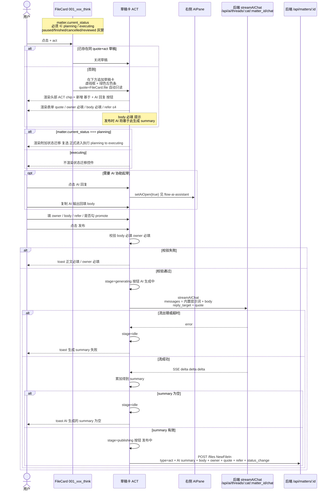

# ACT 卡片创建/发布交互时序

> 来源：`图片/act卡片.jpg`
> + 代码：`MatterDetailPane.tsx:generateSummaryViaChat`、`CreateFileDialog.tsx:CreateFileForm`（onGenerateSummary 路径）
> + 文档：`pivot-product.md` §三 §五 §九·1
>
> AI 助手部分见 [`flow-ai-assistant.md`](./flow-ai-assistant.md)

