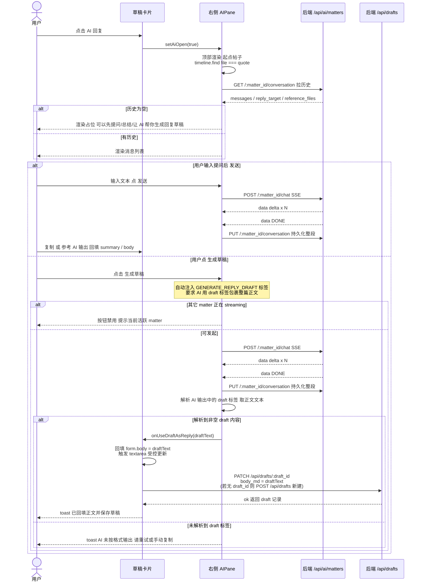

# 通用：AI 助手（草稿卡 → 右侧 AIPane）交互时序

> 来源：`图片/AI卡片.jpg` + `图片/think+ai组手总览图.jpg`
> + 代码：`MatterDetailPane.tsx`、`AIPane.tsx`、`server/api/ai.py`、`server/api/drafts.py`
>
> Endpoint：`/api/ai/matters/{matter_id}/...`

---

## 关键约定

| 项 | 说明 |
|---|---|
| matter 维度 | 所有 matter 详情页 AI 都用 matter_id 作为唯一键；不同 matter 会话互相隔离 |
| 起点帖子 | 仅当 pendingCreate 存在（即草稿卡打开时）才渲染；从 timeline.find(t.file === quote) 取 |
| 生成草稿按钮 | 自动注入 GENERATE_REPLY_DRAFT 标签，要求 AI 输出用 draft 标签包裹完整正文 |
| 跨 matter 锁 | 全局 activeStream 单例：同一时间只允许一个 matter streaming |
| 会话持久化 | 流结束后一次性 PUT 整段；中途关闭页面会丢失最新流消息 |
| 回填 + 保存 | 生成草稿成功后：先回填到草稿卡 form.body，再 PATCH /api/drafts/:id 持久化；若卡片尚无 draft_id，先 POST 新建 |
| 生成 summary 链路 | act / verify 发布前的 streamAIChat 走 /api/ai/matters/:matter_id/chat，但只本地累加返回，不写 conversation |
