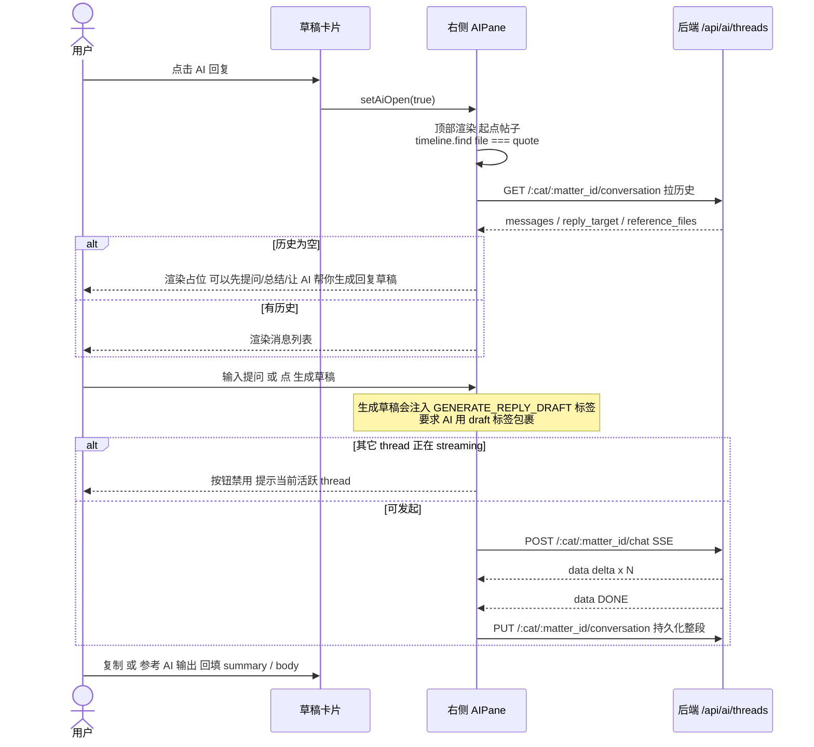

# 通用：AI 助手（草稿卡 → 右侧 AIPane）交互时序

> 来源：`图片/AI卡片.jpg` + `图片/think+ai组手总览图.jpg`
> + 代码：`MatterDetailPane.tsx`、`AIPane.tsx`、`api.ts:streamAIChat`、`server/api/ai.py`
>
> Endpoint：`/api/ai/threads/{category}/{matter_id}/...`（matter 复用 thread 命名空间）

