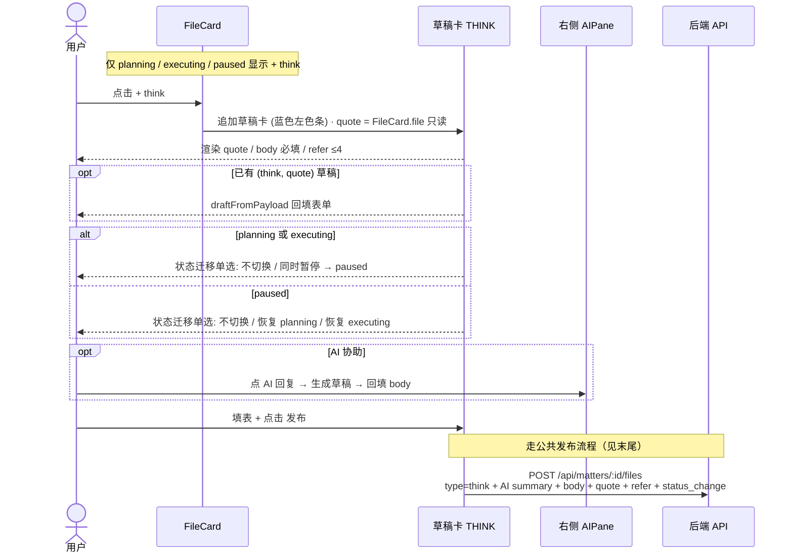
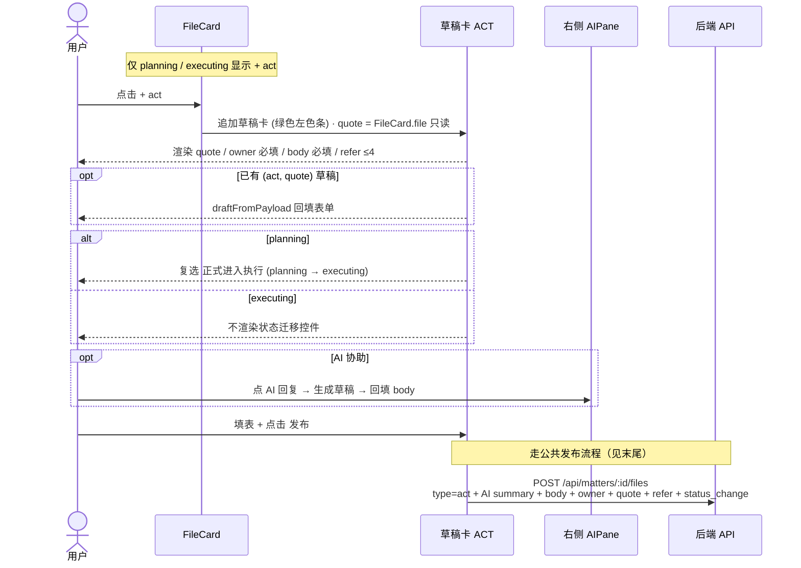
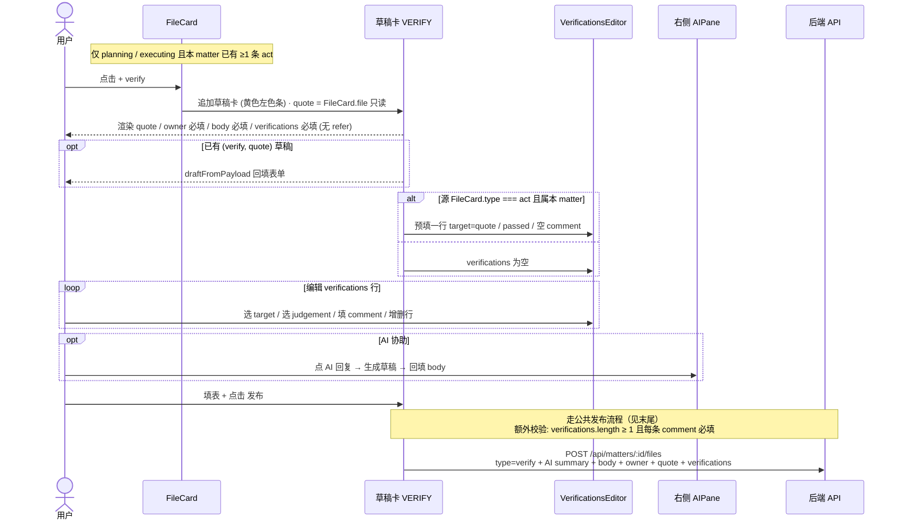
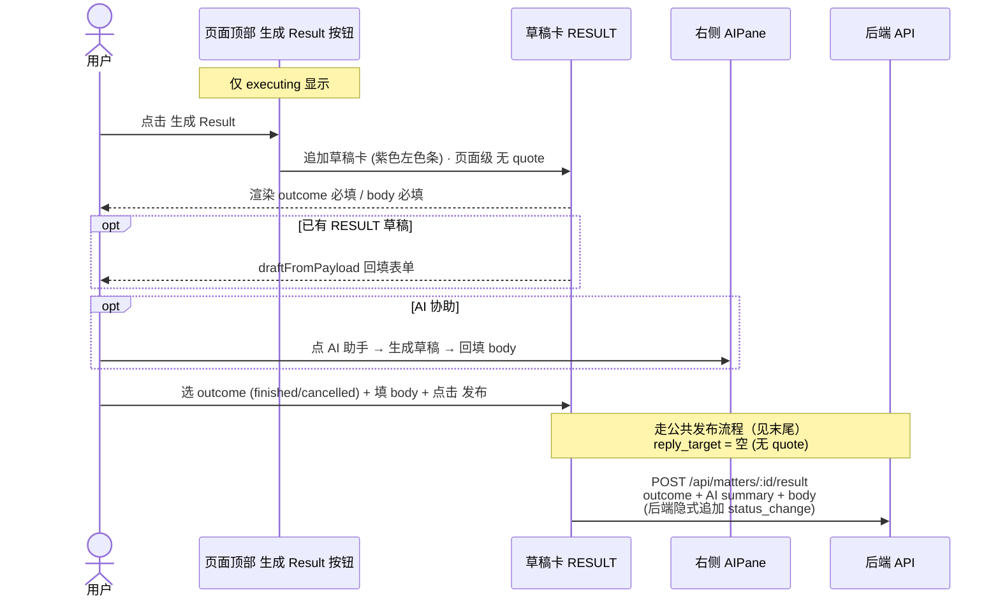
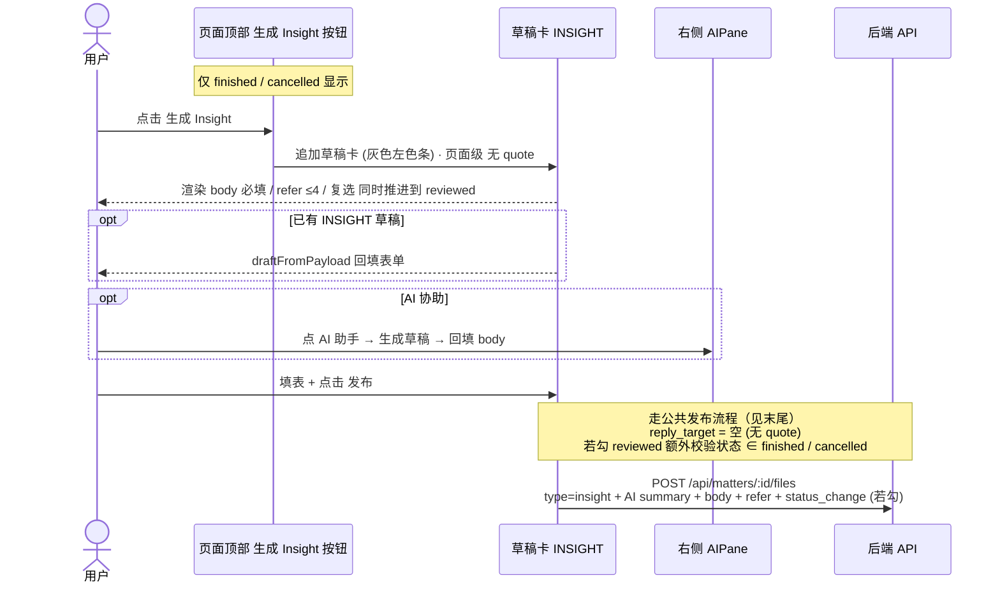
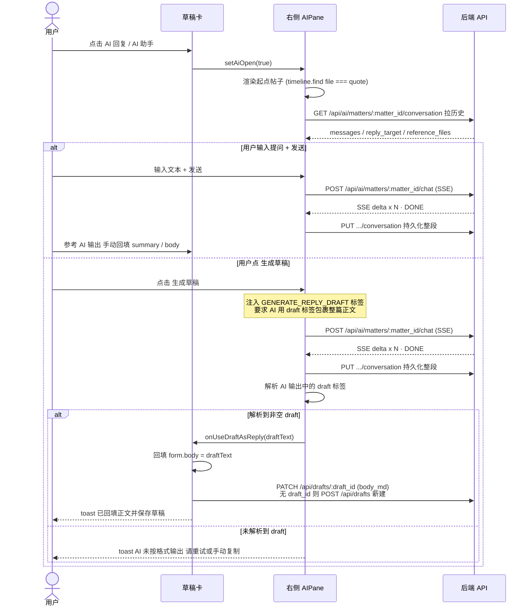

# 五类卡片创建/发布交互时序合集

> 整体风格、participants 命名、`alt / opt / Note over` 用法、措辞习惯均**继承上一版本**单文件（`flow-think-card.md` / `flow-act-card.md` / `flow-verify-card.md` / `flow-result-card.md` / `flow-insight-card.md`）。
>
> 合集做了一次**简化屏蔽**：把"校验 → AI 生成 summary 三段式 → POST 落盘"这条**公共发布流程**抽到文末，每张图里点 `发布` 后只留一行 Note 引用，不再展开嵌套 alt。需要看完整细节请回到对应单文件图。
>
> AI 助手部分见 [`flow-ai-assistant.md`](./flow-ai-assistant.md)

---

## ① THINK 卡片

---

## ② ACT 卡片

---

## ③ VERIFY 卡片

---

## ④ RESULT 卡片（页面级）

---

## ⑤ INSIGHT 卡片（页面级）

---

## 公共发布流程（点 `发布` 后五段执行）

1. **前端校验**必填字段；任一不通过 → toast 错误，停在草稿卡
2. `stage = generating`，按钮显示 **AI 生成中**
3. `streamAIChat` → `POST /api/ai/matters/:matter_id/chat`（SSE）
   - 流出错 / 超时 → toast 失败、`stage = idle`
   - SSE delta 累加得到 summary
   - summary 为空 → toast 失败、`stage = idle`
4. `stage = publishing`，按钮显示 **发布中**
5. POST 落盘
   - think / act / verify / insight → `POST /api/matters/:id/files`
   - result → `POST /api/matters/:id/result`
6. 成功 → toast 成功、清理 pendingCreate / pendingDraftId / pendingInitial、`fetchMatter` 刷新时间轴

---

## 五类速查表

| 维度 | think | act | verify | result | insight |
|---|---|---|---|---|---|
| 入口位置 | FileCard 卡级 | FileCard 卡级 | FileCard 卡级 | 页面顶部 | 页面顶部 |
| quote | FileCard.file | FileCard.file | FileCard.file | 无 | 无 |
| owner | — | 必填 | 必填 | — | — |
| refer | ≤4 | ≤4 | — | — | ≤4 |
| 专属字段 | 状态迁移单选 | promote 复选 | verifications | outcome | 推进 reviewed 复选 |
| 状态前置 | planning / executing / paused | planning / executing | planning / executing 且有 act | 仅 executing | 仅 finished / cancelled |
| 落盘 endpoint | `/files` | `/files` | `/files` | `/result` | `/files` |
| 状态后置 | 不变 / paused 进出 | 不变 / → executing | 不变 | → finished/cancelled | 不变 / → reviewed |

---

## ⑥ AI 助手（通用 · 触发自所有草稿卡的 `AI 回复` / `AI 助手` 按钮）

### 约定速查

| 项 | 说明 |
|---|---|
| matter 维度 | 用 matter_id 作为唯一键；不同 matter 会话互相隔离 |
| 跨 matter 锁 | 前端单例 `activeStream`：同一时间只允许一个 matter streaming（后端无锁） |
| 生成 summary 链路 | 公共发布流程里的 streamAIChat 与本图共用 endpoint，但**不写 conversation**，只本地累加返回 |
