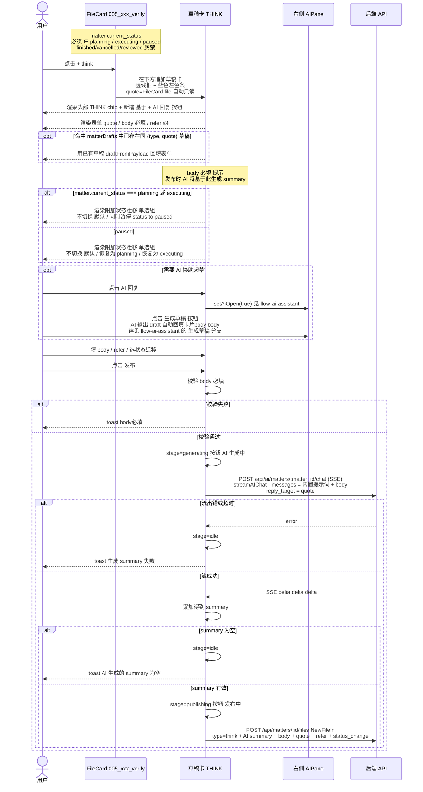
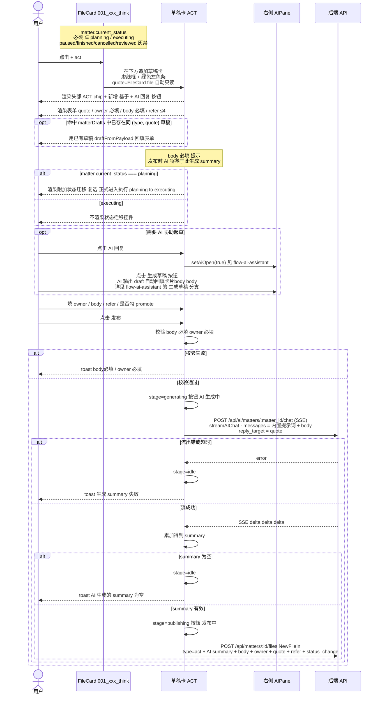
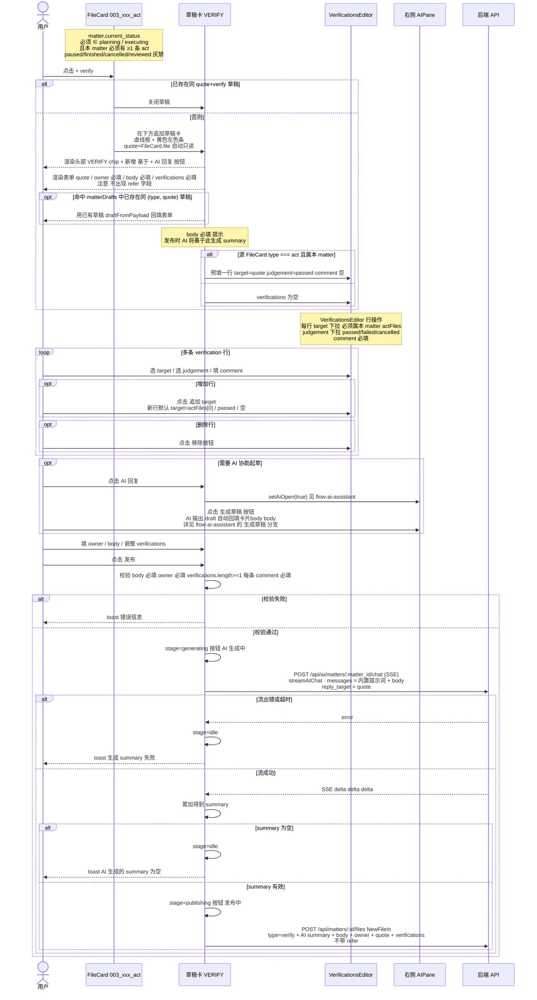
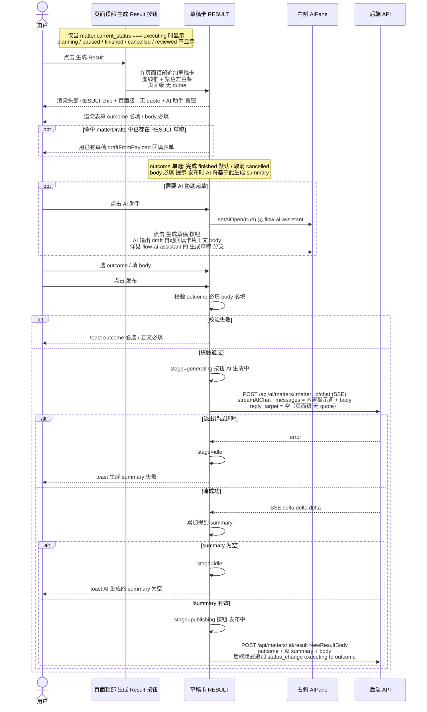
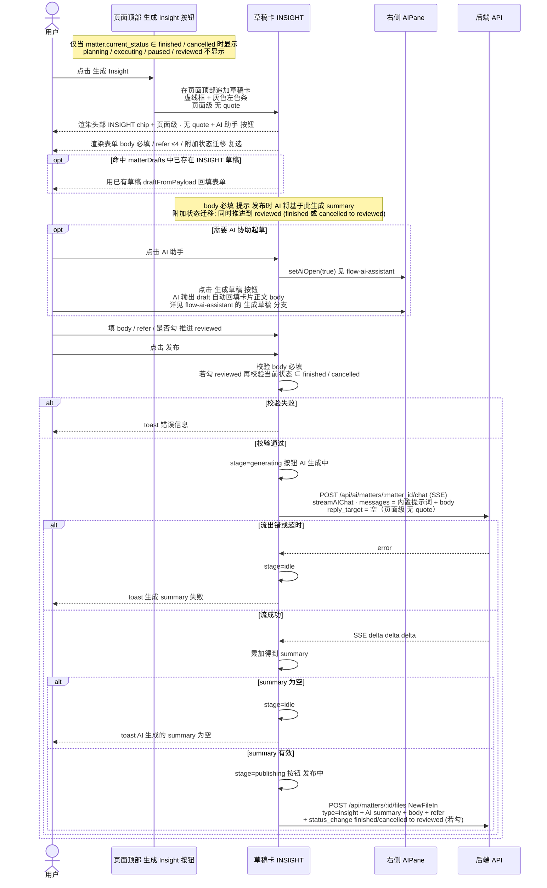

# 五类卡片创建/发布交互时序合集

## ① THINK 卡片创建/发布交互时序

---

## ② ACT 卡片创建/发布交互时序

---

## ③ VERIFY 卡片创建/发布交互时序

---

## ④ RESULT 卡片创建/发布交互时序

### 与 act / verify 的核心差异

| 维度 | act / verify | result |
|---|---|---|
| 入口位置 | FileCard 底部按钮（卡级） | 页面顶部按钮（页面级） |
| quote | 自动带入 = FileCard.file | **无**（result 对象就是 matter 本身） |
| owner | 必填 | 无 |
| refer | act 可选 / verify 无 | 无 |
| 类型专属字段 | act: actPromote 复选；verify: verifications | **outcome 单选 finished/cancelled** |
| status_change | 由前端组装 | **后端 `append_result` 隐式追加** `{from: current_status, to: outcome}` |
| 落盘 endpoint | `POST /api/matters/:id/files` | `POST /api/matters/:id/result` |
| 状态前置 | planning / executing | **仅 executing** |
| 后置语义 | 可重复追加 | **唯一**：一个 matter 只允许一篇有效 result（pivot-product §九·4） |

---

## ⑤ INSIGHT 卡片创建/发布交互时序

### 与 act / verify / result 的核心差异

| 维度 | act / verify | result | insight |
|---|---|---|---|
| 入口位置 | FileCard 底部按钮（卡级） | 页面顶部按钮（页面级） | 页面顶部按钮（页面级） |
| quote | 自动带入 | 无 | 无 |
| owner | 必填 | 无 | 无 |
| refer | act 可选 / verify 无 | 无 | **可选 ≤4** |
| 类型专属字段 | act: actPromote / verify: verifications | outcome 单选 | **附加状态迁移 复选: 同时推进到 reviewed** |
| 落盘 endpoint | `POST /api/matters/:id/files` | `POST /api/matters/:id/result` | `POST /api/matters/:id/files` |
| 状态前置 | planning / executing | 仅 executing | **仅 finished / cancelled** |
| 后置语义 | 可重复追加 | 唯一 | 可重复，可选触发 reviewed 收口 |
