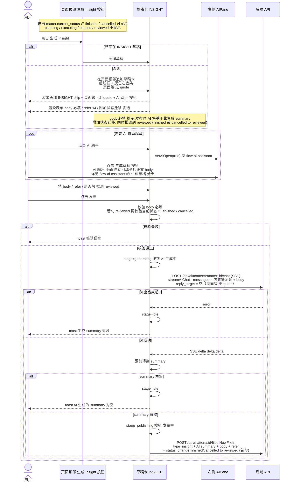

# INSIGHT 卡片创建/发布交互时序

> 来源：`图片/insight.jpg`
> + 代码：`MatterDetailPane.tsx`、`CreateFileDialog.tsx:CreateFileForm`（kind=page · type=insight）、`server/api/matters.py:append_file`
> + 文档：`pivot-product.md` §三（insight 类型）§五（finished/cancelled 只允许 insight）
>
> AI 助手部分见 [`flow-ai-assistant.md`](./flow-ai-assistant.md)
> 草稿、summary、AI 协助交互与 act 一致；insight 是**页面级**动作，无 quote、无 owner、无 verifications。

---

## 与 act / verify / result 的核心差异

| 维度 | act / verify | result | insight |
|---|---|---|---|
| 入口位置 | FileCard 底部按钮（卡级） | 页面顶部按钮（页面级） | 页面顶部按钮（页面级） |
| quote | 自动带入 | 无 | 无 |
| owner | 必填 | 无 | 无 |
| refer | act 可选 / verify 无 | 无 | **可选 ≤4** |
| 类型专属字段 | act: actPromote / verify: verifications | outcome 单选 | **附加状态迁移 复选: 同时推进到 reviewed** |
| 落盘 endpoint | `POST /api/matters/:id/files` | `POST /api/matters/:id/result` | `POST /api/matters/:id/files` |
| 状态前置 | planning / executing | 仅 executing | **仅 finished / cancelled** |
| 后置语义 | 可重复追加 | 唯一 | 可重复，可选触发 reviewed 收口 |
