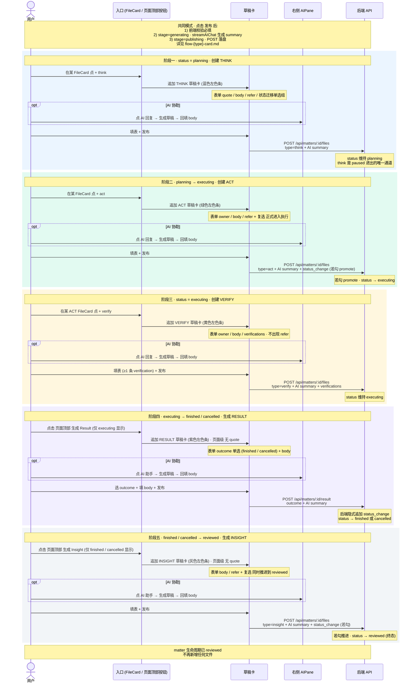

# Matter 生命周期总流程交互设计

> 把 think → act → verify → result → insight 五阶段串成一条 matter 完整生命周期的交互链路。
>
> 每段落只画"入口 → 草稿卡 → 发布 → 落盘 → 状态变化"主干；表单细节、校验、AI summary 三段式 stage（idle / generating / publishing）、回填已有草稿等公共模式见各 `flow-*-card.md` 单图。
>
> AI 助手部分见 [`flow-ai-assistant.md`](./flow-ai-assistant.md)

---

---

## 五阶段速查表

| 阶段 | 入口 | 状态前置 | type | 专属字段 | 落盘 endpoint | 状态后置 |
|---|---|---|---|---|---|---|
| ① think   | FileCard 卡级 | planning / executing / paused | think   | 状态迁移单选组（含 paused 进出） | POST /files | 不变 或 paused 进出 |
| ② act     | FileCard 卡级 | planning / executing | act     | 复选 正式进入执行（仅 planning） | POST /files | planning → executing（若勾） |
| ③ verify  | FileCard 卡级（须有 act） | planning / executing | verify  | verifications 编辑器 ≥1 条 | POST /files | 不变 |
| ④ result  | 页面顶部 | executing | result  | outcome 单选（finished / cancelled） | POST /result | executing → outcome |
| ⑤ insight | 页面顶部 | finished / cancelled | insight | 复选 同时推进到 reviewed | POST /files | 不变 或 → reviewed |
