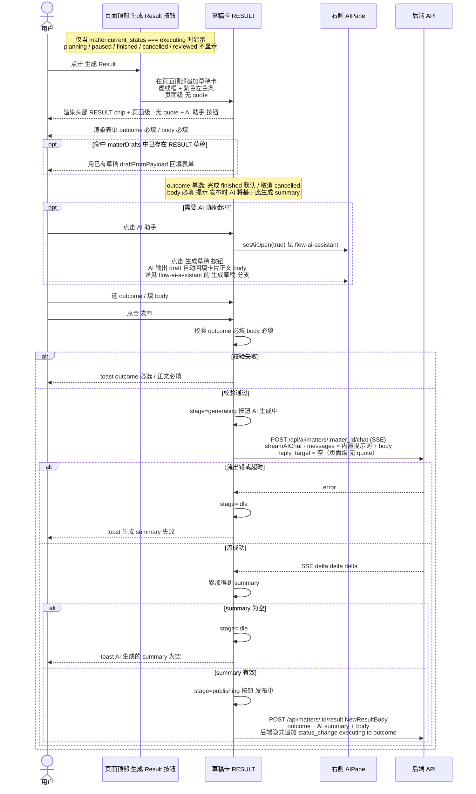

# RESULT 卡片创建/发布交互时序

> 来源：`图片/result卡片.jpg`
> + 代码：`MatterDetailPane.tsx`、`ResultConfirmDialog.tsx`、`appendMatterResult`、`server/api/matters.py:append_result`
> + 文档：`pivot-product.md` §三 §九·4 §十三（"生成 Result" 页面级动作）
>
> AI 助手部分见 [`flow-ai-assistant.md`](./flow-ai-assistant.md)
> 草稿、summary、AI 协助交互与 act 一致；result 是**页面级**动作，无 quote、无 owner、无 refer。

---

## 与 act / verify 的核心差异

| 维度 | act / verify | result |
|---|---|---|
| 入口位置 | FileCard 底部按钮（卡级） | 页面顶部按钮（页面级） |
| quote | 自动带入 = FileCard.file | **无**（result 对象就是 matter 本身） |
| owner | 必填 | 无 |
| refer | act 可选 / verify 无 | 无 |
| 类型专属字段 | act: actPromote 复选；verify: verifications | **outcome 单选 finished/cancelled** |
| status_change | 由前端组装 | **后端 `append_result` 隐式追加** `{from: current_status, to: outcome}` |
| 落盘 endpoint | `POST /api/matters/:id/files` | `POST /api/matters/:id/result` |
| 状态前置 | planning / executing | **仅 executing** |
| 后置语义 | 可重复追加 | **唯一**：一个 matter 只允许一篇有效 result（pivot-product §九·4） |
