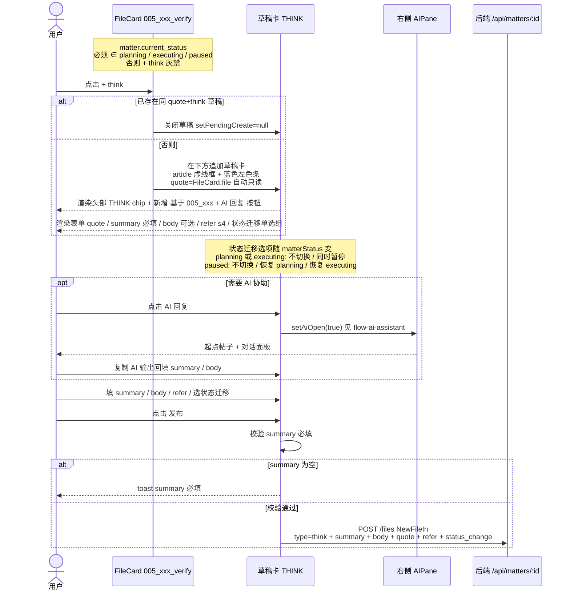

# THINK 卡片创建/发布交互时序

> 来源：`图片/think卡片.jpg` + `图片/think+ai组手总览图.jpg`
> + 代码：`MatterDetailPane.tsx`、`CreateFileDialog.tsx:CreateFileForm`、`timeline-config.ts`
> + 文档：`pivot-product.md` §三 §五 §1.2
>
> AI 助手部分见 [`flow-ai-assistant.md`](./flow-ai-assistant.md)

