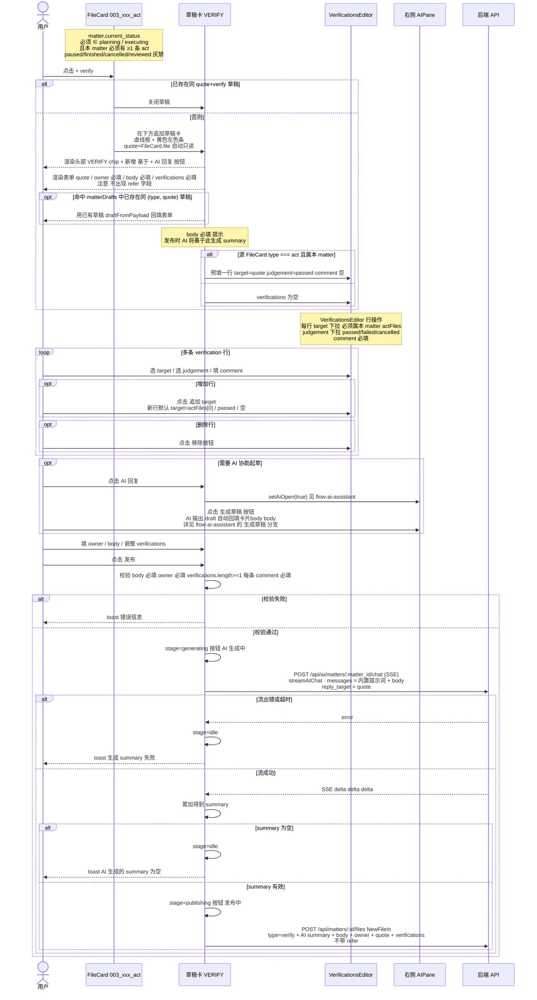

# VERIFY 卡片创建/发布交互时序

> 来源：`图片/verfiy卡片.jpg`
> + 代码：`MatterDetailPane.tsx:generateSummaryViaChat`、`CreateFileDialog.tsx:CreateFileForm`（verify 分支 + VerificationsEditor）
> + 文档：`pivot-product.md` §三 §五 §九
>
> AI 助手部分见 [`flow-ai-assistant.md`](./flow-ai-assistant.md)
> summary 由 AI 基于 body 自动生成，与 think / act 一致。

